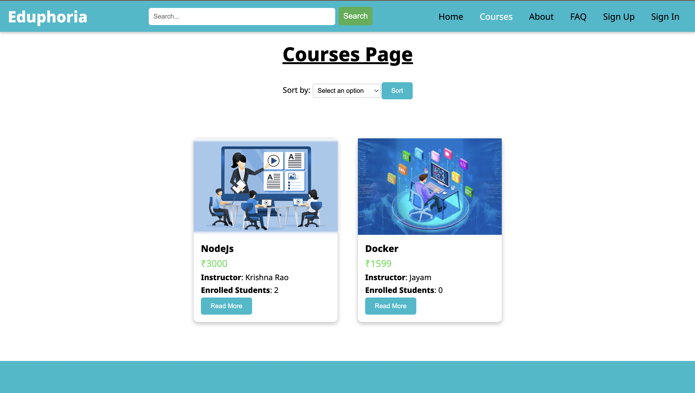
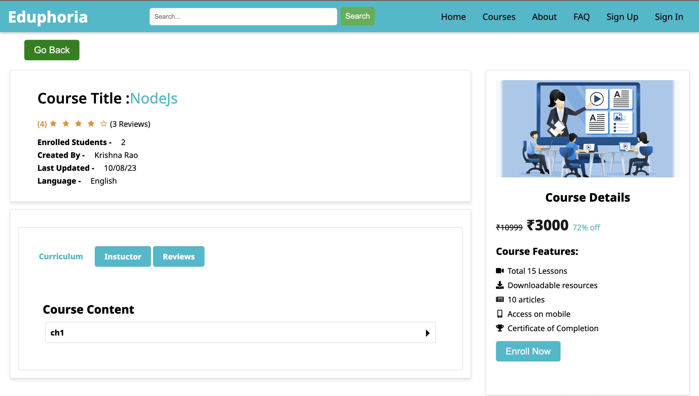

# Eduphoria - E-Learning Platform

Welcome to Eduphoria, an e-learning platform built using the MERN stack. Eduphoria offers a comprehensive set of features for teachers, students, and administrators, facilitating seamless learning and management within the platform.

## Deployment Links

- Frontend : https://eduphoria-mern-frontend.vercel.app/
- Backend : https://eduphoria-mern-backend.onrender.com/

- Documentation :  https://eduphoria-mern-backend.onrender.com/api-docs 

## Screenshots

1. **Home Page**
   

2. **Courses Page**
   

3. **Single Course Page**
   

4. **Specialized Home Page**
   

5. **Course Content Page**
   

6. **Quiz Page**
   

7. **Teacher Course Update Page**
   

8. **Admin Dashboard**
   


## How to Run

To get started with Eduphoria, follow these steps:

1. Clone the GitHub repository:
```bash
git clone https://github.com/Preetham-jayam/Eduphoria_MERN.git
```

2. Open your terminal and navigate to the cloned directory.


3. Install Node.js modules for both the client and server:
```bash
cd client
npm install
```

```bash
cd server
npm install
```

4. ## Environment Variables

To run this project, you will need to add the following environment variables to your `.env` file:

- `ADMIN_EMAIL`: `<admin_email>`
- `ADMIN_PASSWORD`: `<admin_password>`
- `MONGODB_URL`: `<mongodb_url>`
- `CLOUD_NAME`: `<cloud_name>`
- `API_KEY`: `<api_key>`
- `API_SECRET`: `<api_secret>`
- `CLOUDINARY_URL`: `<cloudinary_url>`

5. Start the development server:

```bash
cd client
npm start
```

```bash
cd server
npm start
```

6. Access the website at [http://localhost:3000](http://localhost:3000).

## Users

Eduphoria caters to three main types of users:

- Teacher
- Student
- Admin

## Features

### General Features

- All users can view the website and browse available courses.
- Access to courses requires signup and signin.
- Good authentication system using JWT tokens.
- Forgot password functionality is available.
- Implemtation of mutations for getting data from server using modern redux-toolkit

### Student Features

- Students have their own dashboard.
- Enrollment in courses is open to students.
- Students can comment on enrolled courses.
- Access to chapters and lessons within enrolled courses.
- Profile and account editing capabilities.
- Multiple attempts for course quizzes.
- Certificate download upon course completion.

### Teacher Features

- Teachers can add courses upon approval by the admin.
- Dashboard for managing courses.
- Course creation, chapter and lesson addition, update, and deletion.
- Quiz question creation.
- Profile and account management.

### Admin Features

- User management including blocking and deletion.
- Approval or rejection of teacher requests.
- Course management including addition and deletion.
- Admin Can send mails to students to share any important messages.
